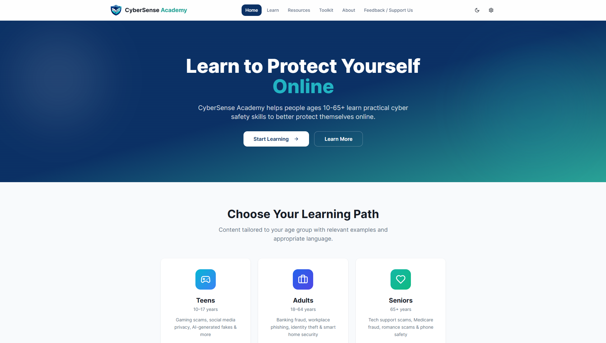
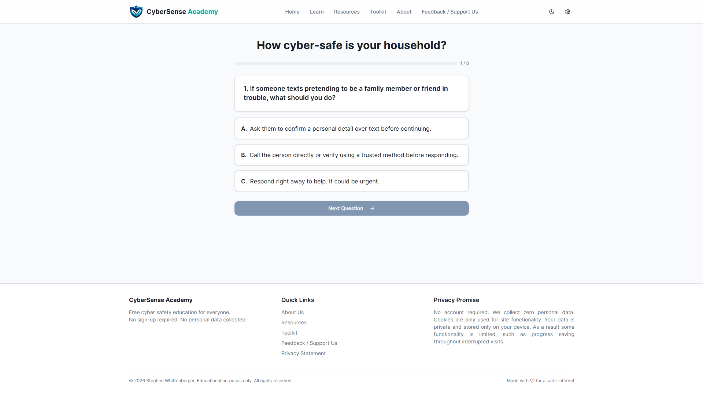
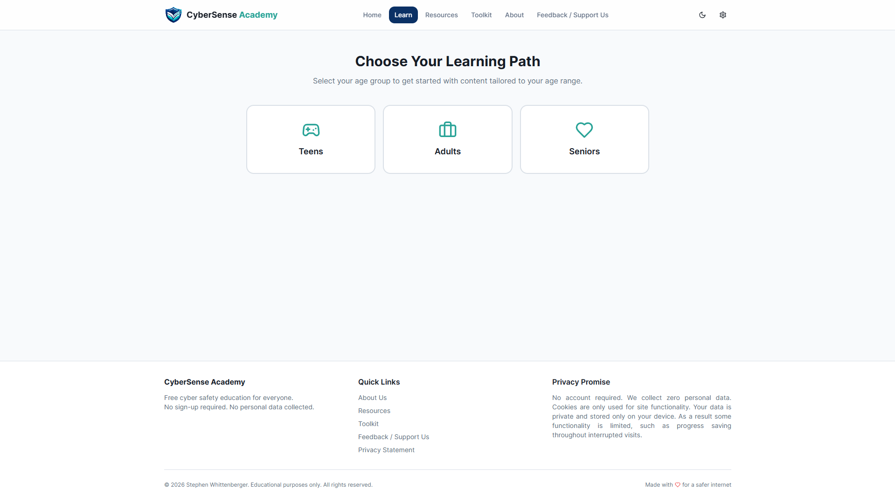
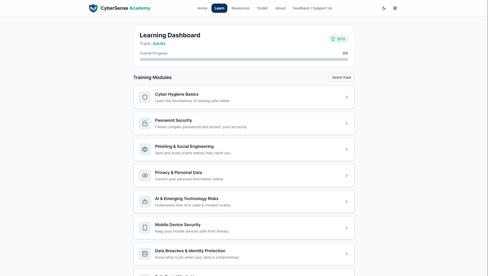
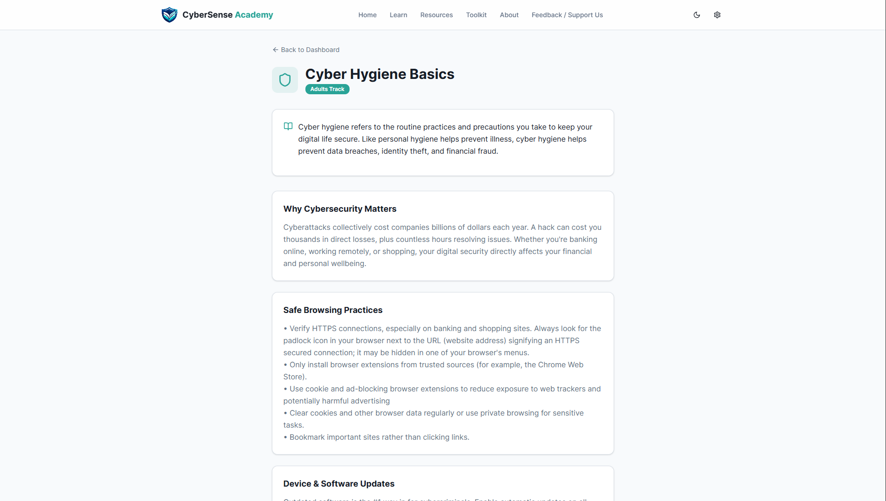
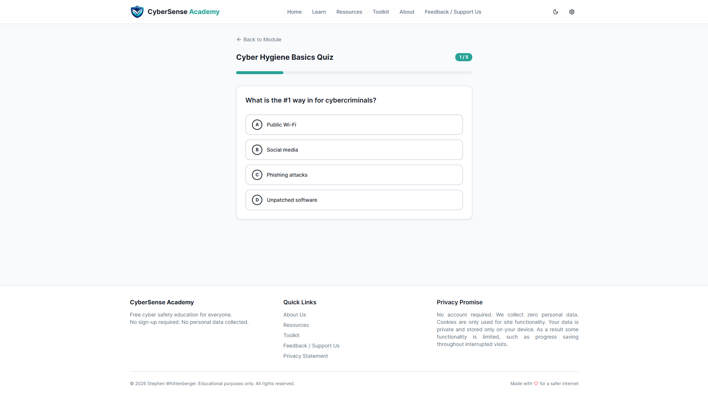
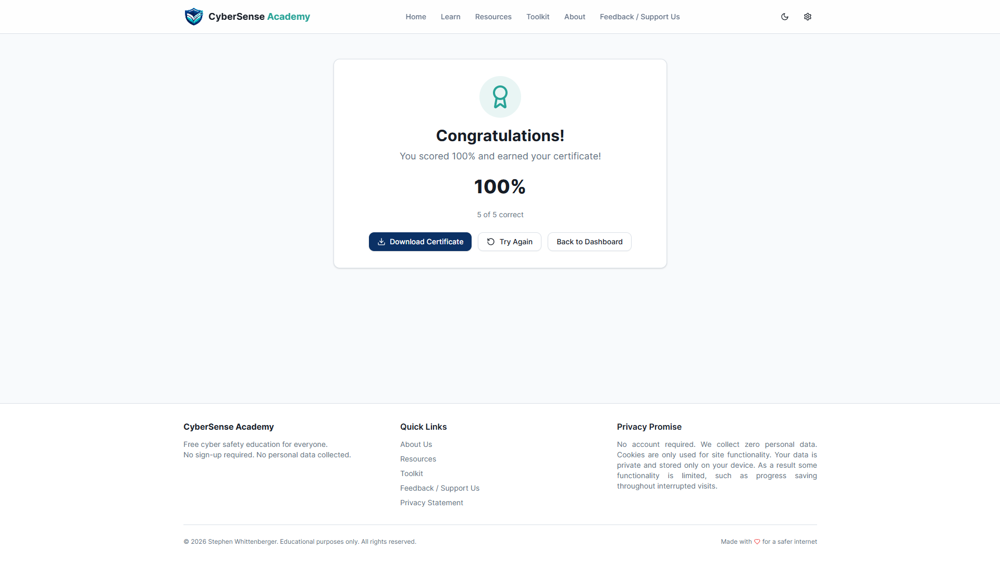
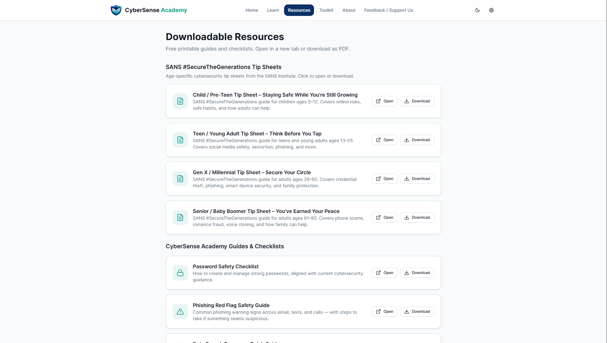
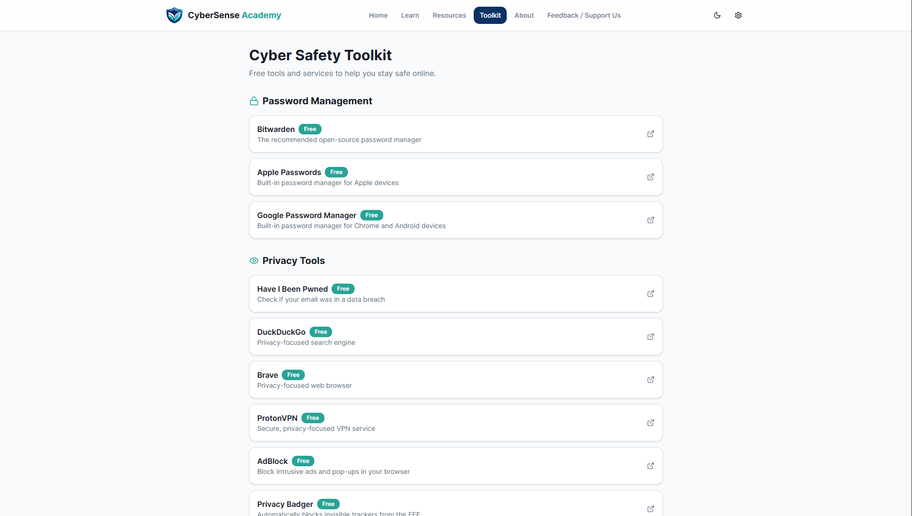

# CyberSense Academy | Public Project Showcase

CyberSense Academy is a cybersecurity education platform designed to help teenagers, adults, and seniors learn practical cyber hygiene habits through accessible, age-appropriate content.

## Why this repository exists

This is a public companion repository for the CyberSense Academy project. The project is publicly available as a live site, but the production codebase is kept private in order to prevent, to the extent possible, unauthorized site duplication and/or modification of the learning content.

The CyberSense Academy platform is intended to be a trusted source of accurate information to educate non-technical people from all backgrounds and across the age spectrum on cyber safety topics. It is in the interest of our users to do what we can to prevent duplication, content manipulation, or any other unauthorized changes that would harm the integrity and credibility of the platform. 

## Motivation

Cybersecurity incidents consistently show that humans are the most exploited vulnerability in digital security, especially those ignorant of essential cyber hygiene practices and the digital threat landscape. CyberSense Academy was created to make foundational cybersecurity knowledge more understandable, practical, and widely accessible for everyday people across the age spectrum.

The project focuses on helping people build habits they can apply immediately, such as recognizing scams, understanding the basics of social engineering, using a password manager to create and store unique, complex passwords, understanding the importance of using Multi-Factor Authentication (MFA) and passkeys wherever possible, recognizing the malicious uses of emerging technologies, and more. It is not intended as a comprehensive cybersecurity course, but rather as a crash course on the fundamental elements of cyber hygiene that all internet users should be well-versed in and a platform to pique curiosity and foster further learning.

## Live project

The live site is available at:

>https://cybersense-academy.pages.dev/

## Screenshots

## Technical stack summary

- React
- Vite
- JavaScript / JSX
- HTML / CSS
- Cloudflare Pages

## AI-assisted workflow transparency disclosure

AI tools were used for support during the development of this project.

### AI tools utilized (and for what purposes):

- ChatGPT (generating the initial Base44 prompt based on my concept and requirements; graphic design/image generation)
- Base44 (generating the core codebase and initial modifications)
- Perplexity AI (brainstorming leaning content; assisting with deployment troubleshooting; drafting documentation)
- GitHub Copilot (general software engineering assistance; code security scans)

### My contributions:
- Defined the project concept and mission
- Reviewed, revised, and made final decisions on all AI-generated suggestions and modifications
- Wrote and curated site content
- Edited and organized the Base44-generated core codebase into the finalized production codebase
- Managed deployment and publication

## License

This repository, its contents, and the assets of the CyberSense Academy platform are not open source. Unless otherwise stated, all rights are reserved.

No permission is granted to copy, modify, redistribute, republish, or create derivative works from the source code, educational content, branding, design assets, or documentation in this repository or otherwise belonging to the CyberSense Academy platform without prior written permission from the author.

If you would like to discuss permitted use, collaboration, or licensing, please contact the author directly.
